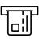

# plantuml-icons
### Overview
| Name  | Macro  | Image | Url |
|-------|--------|-------|-----|
api |API | |api.puml |
dynamics_crm |DYNAMICS_CRM | |dynamics_crm.puml |
paper_form |PAPER_FORM | |paper_form.puml |
power_bi |POWER_BI | |power_bi.puml |
sage |SAGE | |sage.puml |
scheduled_job |SCHEDULED_JOB | |scheduled_job.puml |
smart_card_reader | SMART_CARD_READER | | smart_card_reader.puml |
smart_card | SMART_CARD | | smart_card.puml |
umbraco | UMBRACO | | umbraco.puml |
web | WEB | | web.puml |
weigh_scale | WEIGH_SCALE | | weigh_scale.puml |
